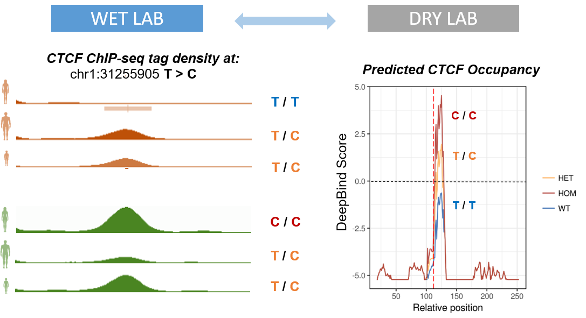

# DeepBindTK
DeepBindTK is a wrapper around DeepBind aimed to predict and plot TF binding affinity differences between individuals.
I wrote this some time ago, so apologies if you find the coding practices disgusting.

### Overview

### Required software
* Perl
* R (>= 3.3). In addition Rscript must be accessible
* [BEDtools](https://github.com/arq5x/bedtools2)
* [SAMtools](http://www.htslib.org/)
* GNU core utils:  wget, awk, sort, cat, grep, head, tail, sed, cut, paste, uniq, wc and mv.
  For macOS users: install Homebrew (https://brew.sh/) and the latest XCode.

#### Required Perl modules
* Parallel::ForkManager
* Sort::Key::Natural
* Statistics::Descriptive

#### Required R packages
* ggplot2

